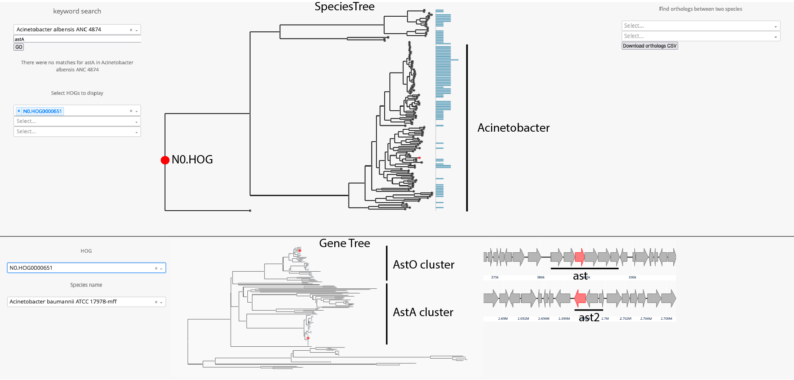
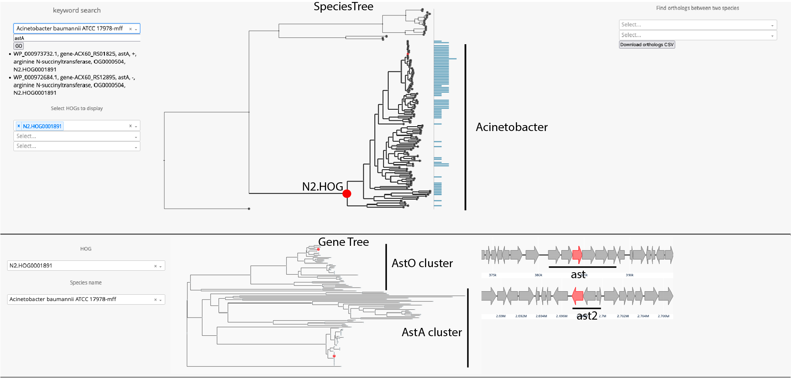
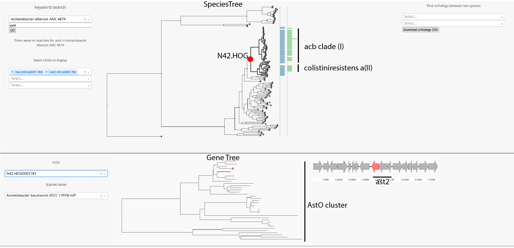

# Dash_app_Acinetobacters  
## Prerequisites  
* ncbi datasets cli https://www.ncbi.nlm.nih.gov/datasets/docs/v2/download-and-install/  
* OrthoFinder 2.5.4 https://github.com/davidemms/OrthoFinder   
* python packages: `pandas` `numpy` `plotly` `Bio.AlignIO` `dash`

## Run set_up_dash_app.ipynb to:  
1. Download genomes and their summaries from NCBI datasets database   
2. Run orthofinder on proteomes  
3. Build local python interactive dash app from orthofinder results

## Once you have run the notebook:   
* go to your terminal,  and cd to the directory containing set_up_dash_app.ipynb and app1.py  
run:  
* `python3 app1.py`  
* this will start a local server that you can access via http://127.0.0.1:8050/ 
to view the application in a web browser.

## Find HOGs of interest and select them at different phylogenetic levels
### Select N0 node in tree to show info on selected HOG at NO level.
* Here we have selected HOG N0.HOG0000651, which contains all genes that descended from
  the an ancestral gene of astA and AstO (we'll call it AncAstA/O) of this ancestral species
   represented by represented by the N0 node on this tree, the last common ancestor of all organisms in this analysis.
* In the lowere pane of the app, you can see a gene tree of all proteins in the selected HOG. Here AstA and AstO in
  Acinetobacter cluster away from non-Acinetobacter AstA genes.
  

  
### Select N2 node in tree, LCA of all acinetobacters 
* This HOG contians all AstA/O genes that descended from the LCA of acinetobacters.
* This analysis suggests that the LCA of Acinetobacters still only contained one AstA/O gene.
  

### Select N42 node in tree, a common ancestor of acb (I) and colisiniresistens (II) clades.
* At N42, the N2 HOG has split into two N42 HOGs, one containing the AstA genes, and the other containing the
  AstO genes from the partial Ast2 operon
  

